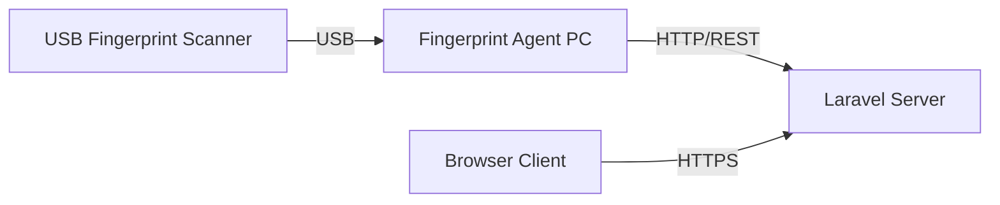

# Fingerprint System Setup Guide

## 1. Overview
The fingerprint authentication system consists of three main components:
1.  **Frontend**: The web interface (Laravel Blade) where HR selects an employee and initiates capture.
2.  **Backend**: The Laravel application that handles data storage and encryption.
3.  **Hardware Bridge (Agent)**: A local middleware application that connects the physical USB scanner to the web application.

## 2. Hardware Requirements
*   **Device**: ZKTeco USB Fingerprint Scanner (Supported models: ZK4500, ZK9500, SLK20R).
*   **Connection**: USB 2.0 port on the machine running the "Fingerprint Agent".

## 3. Architecture


## 4. How It Works
1.  **HR Admin** selects an employee on the `/hrm/fingerprint` page.
2.  **Laravel Server** sends a `POST` request to the configured `FINGERPRINT_AGENT_URL` (default: `http://127.0.0.1:8282`).
    *   *Note*: If the scanner is connected to a different machine than the server, you must update the `FINGERPRINT_AGENT_URL` in your `.env` file to point to that machine's IP address.
3.  **Fingerprint Agent** (running on the machine with the scanner):
    *   Receives the command.
    *   Activates the USB device.
    *   Captures the fingerprint image and converts it to a template.
    *   Returns the template data (Base64) to Laravel.
4.  **Laravel** encrypts the template using AES-256-GCM and stores it in the `biometric_templates` table linked to the `employee_id`.

## 5. Setting Up the Fingerprint Agent
The Laravel application expects an HTTP service listening on port `8282`. You need to run the ZKTeco middleware (not included in this repo) or a custom Node.js/Python script that wraps the ZKTeco SDK.

### Example Agent Logic (Node.js)
A simple mock agent is provided in `mock_device.js` for testing. For production, you need a real implementation using `zkteco-sdk-node` or similar libraries.

```javascript
// Example Endpoint Structure
POST /handshake
Response: { "ok": true }

POST /capture
Response: {
    "ok": true,
    "template": "Base64String...",
    "device_sn": "ZK4500-123",
    "quality": 85
}
```

## 6. Configuration
Update your `.env` file to point to the correct Agent URL:
```env
# If scanner is on the same server
FINGERPRINT_AGENT_URL=http://127.0.0.1:8282

# If scanner is on a client PC (e.g., HR Desk with IP 192.168.1.50)
FINGERPRINT_AGENT_URL=http://192.168.1.50:8282
```
